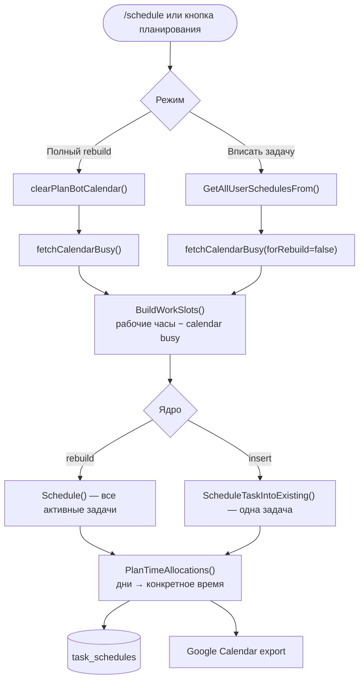
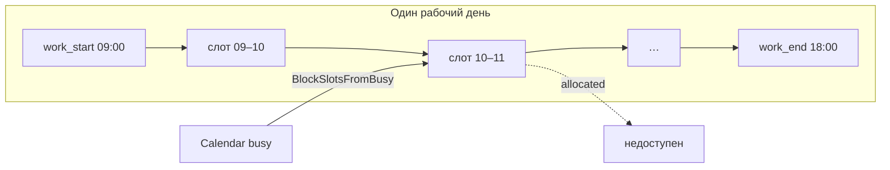
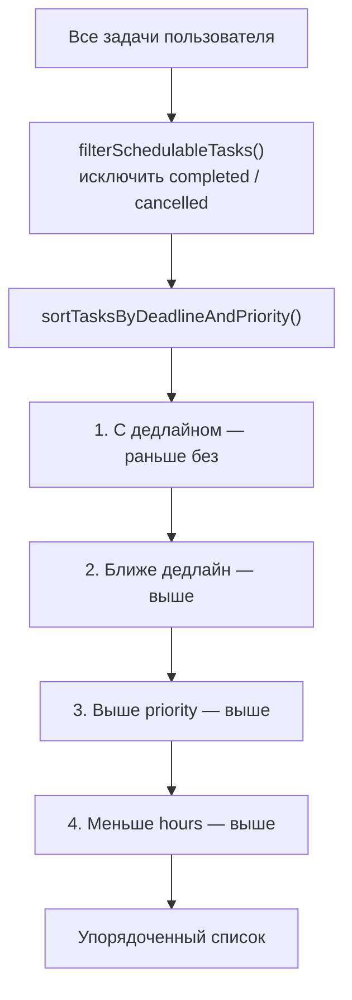
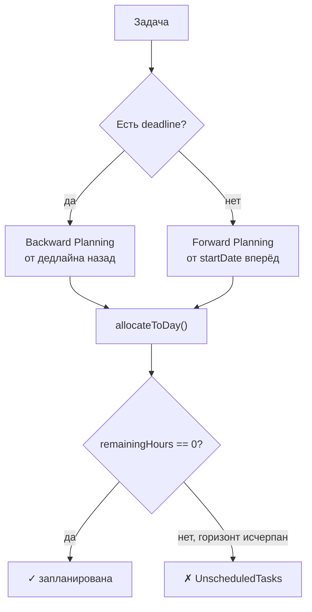
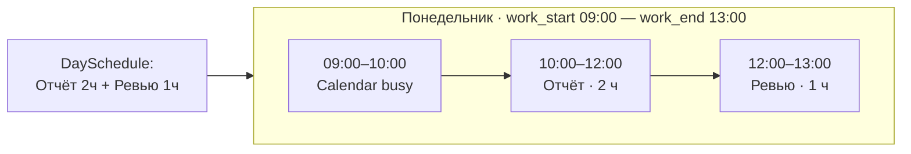

# Алгоритм планирования PlanBot

> **Deadline-Aware Hybrid Scheduling** — гибридное планирование с учётом дедлайнов, слотов времени и Google Calendar

PlanBot распределяет задачи пользователя по рабочим дням и конкретным часам. Алгоритм реализован в пакете `scheduler/` и вызывается из `handlers/schedule_exec.go`.

---

## Кратко

| | |
|---|---|
| **Тип** | Жадный алгоритм + backward planning для дедлайнов |
| **Уровни** | 1) часы по дням → 2) время суток в слотах |
| **Сложность** | O(N × D) по времени, O(N + D) по памяти |
| **Горизонт** | 365 дней (`PLANNING_HORIZON_DAYS`) |

---

## Общая схема пайплайна



---

## Входные данные

### Задачи

Каждая задача (`models.Task`):

| Поле | Тип | Описание |
|------|-----|----------|
| `hours_required` | float | Трудоёмкость в часах |
| `priority` | int | 1–10 (10 = наивысший) |
| `deadline` | `*time.Time` | Жёсткий срок (опционально) |
| `status` | string | `completed` / `cancelled` исключаются из планирования |

### Настройки пользователя

| Поле | Default | Роль в алгоритме |
|------|---------|------------------|
| `daily_capacity` | 8.0 | Макс. часов задач в день |
| `work_days` | `[1..5]` | 1=Пн … 7=Вс |
| `time_zone` | `Europe/Moscow` | Стартовая дата, уведомления |
| `work_start` / `work_end` | `09:00` / `18:00` | Сетка временных слотов |

### Внешние ограничения

- **Google Calendar busy** — встречи и all-day события блокируют слоты
- **Дата начала** — завтра в таймзоне пользователя (`scheduleStartDate`)
- **Горизонт** — `PLANNING_HORIZON_DAYS` (default 365)

---

## Этап 0: Подготовка слотов (`work_slots.go`)

Перед day-level планированием строится **сетка временных слотов**:



1. `BuildDailySlots()` — для каждого рабочего дня в горизонте: слоты по 60 мин (`PLANNING_SLOT_MINUTES`)
2. `BlockSlotsFromBusy()` — пересечение с `BusyInterval` из Google Calendar
3. `FreeHoursOnDate()` — оставшаяся ёмкость дня с учётом календаря

> При **полном rebuild** события PlanBot в Google **не** считаются занятостью. При **incremental insert** — stored PlanBot events учитываются.

---

## Этап 1: Фильтрация и сортировка



Реализация: `scheduler.go` → `sortTasksByDeadlineAndPriority()`

**Пример порядка:**

```
1. Задача A: deadline=завтра,  priority=5,  hours=4
2. Задача B: deadline=послезавтра, priority=8, hours=6
3. Задача C: нет дедлайна, priority=10, hours=2
4. Задача D: нет дедлайна, priority=10, hours=5
```

---

## Этап 2: Распределение по дням

Для каждой задачи из отсортированного списка выбирается стратегия:



### Forward (без дедлайна)

```
remaining = hours_required
date = startDate

while remaining > 0 and days < PLANNING_HORIZON_DAYS:
    if not work_day(date): date++; continue
    allocate_to_day(task, date)
    date++
```

### Backward (с дедлайном)

```
remaining = hours_required
date = normalize(deadline)

while remaining > 0 and date >= startDate:
    if work_day(date):
        allocate_to_day(task, date)
    date--
```

**Зачем backward?** Задача с дедлайном ставится **как можно позже**, не съедая ближайшие дни — остаётся место для текучки и задач без срока, при этом дедлайн соблюдается.

### allocateToDay — ключевая функция

```
available = daily_capacity − already_scheduled_today

if workSlots заданы:
    available = min(available, FreeHoursOnDate(workSlots, date))

hours = min(remaining, available)

if workSlots заданы:
    hours = allocateOnSlots(workSlots, date, hours)  // физически блокирует слоты

daySchedule.tasks += {task, hours}
remaining -= hours
```

Две проверки ёмкости:
1. **Дневная** — `daily_capacity`
2. **Слотовая** — свободные часы после calendar busy

---

## Этап 3: Привязка к времени суток (`slots_plan.go`)

Day-level план говорит *сколько часов* на день. `PlanTimeAllocations()` переводит это в *когда именно*:



1. `BuildWorkSlots()` с тем же busy
2. `applyDaySchedulesToSlots()` — жадно заполняет слоты по порядку задач в дне
3. `MergeSlotAllocations()` — соседние блоки одной задачи сливаются
4. Результат: `[]SlotAllocation{Start, End, TaskID}` → экспорт в Google Calendar

---

## Два режима планирования

```mermaid
flowchart TB
    subgraph full["Полный rebuild — /schedule"]
        F1["Все active tasks"]
        F2["Очистить planbot-события в Google"]
        F3["Schedule() с нуля"]
        F4["ClearTaskSchedules + Save"]
        F5["SyncUserSchedule — замена событий"]
        F1 --> F2 --> F3 --> F4 --> F5
    end

    subgraph inc["Incremental — кнопка «Вписать»"]
        I1["Одна новая задача"]
        I2["Загрузить existing schedules"]
        I3["ScheduleTaskIntoExisting()"]
        I4["SaveTaskSchedules — только новые дни"]
        I5["AppendScheduleEvents в Google"]
        I1 --> I2 --> I3 --> I4 --> I5
    end
```



| | Rebuild | Incremental |
|---|---------|-------------|
| Задачи | Все активные | Одна |
| Существующий план | Заменяется | Сохраняется |
| Google Calendar | Delete + Sync | Append |
| Busy PlanBot events | Игнорируются | Учитываются |

---

## Разбиение на несколько дней

```
Задача: 12 часов
daily_capacity: 8

Понедельник: 8 ч
Вторник:     4 ч
```

Выходные (`work_days`) пропускаются:

```
/settings 6 | 1,2,3,4,5,6   → работа в субботу
/settings 4 | 2,3,4,5       → 4 ч/день, Вт–Пт
```

---

## calculateLatestStartDate

Вспомогательная функция для оценки «последнего дня начала» (дедлайн включительно):

```
work_days_needed = ceil(hours_required / daily_capacity)

от deadline идём назад, считая только рабочие дни,
пока не наберём work_days_needed
```

```
deadline = 25.12, hours = 16, capacity = 8
→ ceil(16/8) = 2 рабочих дня
→ latest_start ≈ 24.12 (если оба дня рабочие)
```

Если `latest_start < startDate` — задача попадёт в `UnscheduledTasks`.

---

## Примеры

### Пример 1: Forward + Backward вместе

**Вход** (startDate = пн 06.01.2025, capacity = 8, Пн–Пт):

| Задача | Часы | Priority | Deadline |
|--------|------|----------|----------|
| Task 1 | 6 | 5 | — |
| Task 2 | 12 | 10 | пт 10.01 |

**Результат:**

```
пн 06.01: Task 1 — 6 ч          (forward, ближайший день)
чт 09.01: Task 2 — 8 ч          (backward от пт)
пт 10.01: Task 2 — 4 ч          (backward, дедлайн-день)
```

### Пример 2: Задача не влезает

```
Задача: 40 ч, deadline = завтра, capacity = 8
→ backward от дедлайна: макс. 8 ч
→ UnscheduledTasks += task_id
→ status остаётся pending
```

### Пример 3: Calendar busy сдвигает время

```
work_start=09:00, work_end=13:00
busy: 09:00–10:00 (встреча)
задача: 2 ч на этот день

SlotAllocation: 10:00–12:00 (не 09:00!)
```

---

## Сложность и ограничения

### Сложность

| | |
|---|---|
| **Время** | O(N × D) — N задач, D дней горизонта |
| **Память** | O(N + D + S) — S = количество слотов |

### Что алгоритм гарантирует

- Не превышает `daily_capacity` в день
- Учитывает `work_days` и calendar busy
- Задачи с дедлайном стремятся к backward placement
- Критичные задачи обрабатываются первыми (сортировка)

### Что не делает (by design)

- Не оптимизирует глобально (не ILP / не CP-SAT) — жадный подход
- Не учитывает зависимости между задачами
- Не переносит уже начатые задачи при срыве сроков
- Не учитывает «предпочитаемое время дня» для типов задач

---

## Маппинг код ↔ этапы

| Этап | Файл | Функции |
|------|------|---------|
| Слоты + busy | `work_slots.go` | `BuildWorkSlots`, `BlockSlotsFromBusy`, `FreeHoursOnDate` |
| Day-level | `scheduler.go` | `Schedule`, `scheduleTaskForward/Backward`, `allocateToDay` |
| Time-level | `slots_plan.go` | `PlanTimeAllocations`, `MergeSlotAllocations` |
| Incremental | `incremental.go` | `ScheduleTaskIntoExisting` |
| Busy merge | `busy_merge.go` | `MergeBusyIntervals` |
| Оркестрация | `schedule_exec.go` | `executeFullRebuild`, `executeInsertTask` |

---

## Переменные окружения

| Переменная | Default | Влияние |
|------------|---------|---------|
| `PLANNING_HORIZON_DAYS` | `365` | Сколько дней вперёд смотрит планировщик |
| `PLANNING_SLOT_MINUTES` | `60` | Размер одного временного слота |

---

## Тесты

Покрытие в `scheduler/*_test.go`:

- forward / backward planning
- приоритеты и дедлайны
- пропуск выходных
- calendar busy в слотах
- incremental insert
- merge allocations

```bash
go test ./scheduler/... -v
```

---

## Связанные документы

| Документ | Содержание |
|----------|------------|
| [ARCHITECTURE.md](./ARCHITECTURE.md) | Потоки данных, пакеты, интеграции |
| [DATABASE_SCHEMA.md](./DATABASE_SCHEMA.md) | `task_schedules`, хранение плана |

---

*Документ объединяет и заменяет прежние `ALGORITHM.md` и `ALGORITHM_EXPLANATION.md` · июнь 2026*
