# Архитектура PlanBot

> Актуально для текущего репозитория · Go 1.25 · монолит · PostgreSQL 15

PlanBot — Telegram-бот для планирования задач. Приложение построено как **слоистый монолит на Go**: один процесс, long polling Telegram, фоновые напоминания и HTTP health-сервер.

Подробная схема БД: [DATABASE_SCHEMA.md](./DATABASE_SCHEMA.md)

---

## Обзор системы

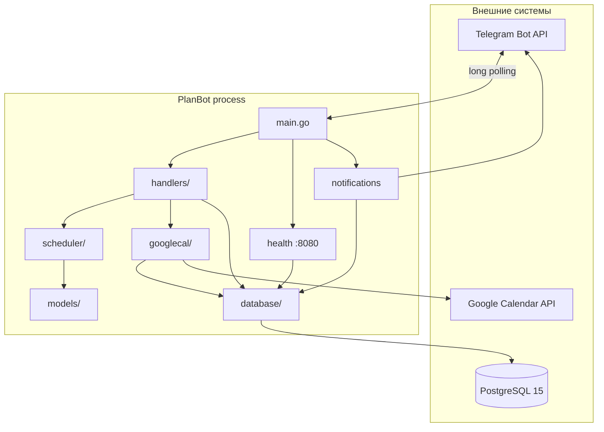

---

## Структура репозитория

```
PlanBot/
├── main.go                      # Точка входа
├── models/                      # Доменные структуры
├── handlers/                    # Telegram UI + оркестрация
│   ├── handlers.go              # Команды, callbacks, форматирование
│   ├── schedule_exec.go         # Полное/инкрементальное планирование
│   ├── calendar_busy.go         # Загрузка занятости из календаря
│   ├── calendar_import.go       # Импорт событий → задачи
│   ├── calendar_task_sync.go    # Синхронизация complete/delete
│   └── handler.go               # Legacy-обработчик (устаревшие команды)
├── scheduler/                   # Алгоритм планирования
│   ├── scheduler.go             # Day-level scheduling
│   ├── work_slots.go            # Слоты, busy-блоки, горизонт
│   ├── slots_plan.go            # Привязка к времени суток
│   ├── incremental.go           # Вписывание одной задачи
│   └── busy_merge.go            # Слияние busy-интервалов
├── database/                    # Персистентность
│   ├── db.go                    # Подключение, EnsureSchema
│   ├── queries.go               # Users, tasks, schedules
│   ├── queries_calendar.go      # Google Calendar links
│   ├── tasks.go                 # Legacy task queries
│   ├── schema.sql               # Полная схема
│   └── migrations.sql           # Инкрементальные миграции
├── googlecal/                   # Google Calendar интеграция
│   ├── googlecal.go             # OAuth config, Client
│   ├── client_user.go           # ClientForUser + refresh token
│   ├── fetch.go                 # Busy intervals из API
│   ├── export.go                # Экспорт SlotAllocation → events
│   ├── sync.go                  # Sync / append / delete
│   └── task_bridge.go           # Импорт событий
├── health/                      # Liveness / readiness
├── notifications/               # Фоновые напоминания о дедлайнах
├── docs/                        # presentation.html, presentation.md
├── Dockerfile
├── docker-compose.yml           # dev (+ Adminer profile)
└── docker-compose.prod.yml
```

---

## Запуск процесса (`main.go`)

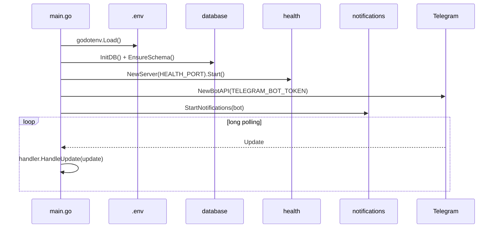

| Компонент | Порт / интервал | Назначение |
|-----------|-----------------|------------|
| Telegram bot | long polling, timeout 60s | Основной UI |
| Health server | `:8080` (HEALTH_PORT) | `/health`, `/ready`, `/` |
| Notifications | ticker 30 min | Напоминания о дедлайнах в 09:00 |

---

## Граф зависимостей пакетов

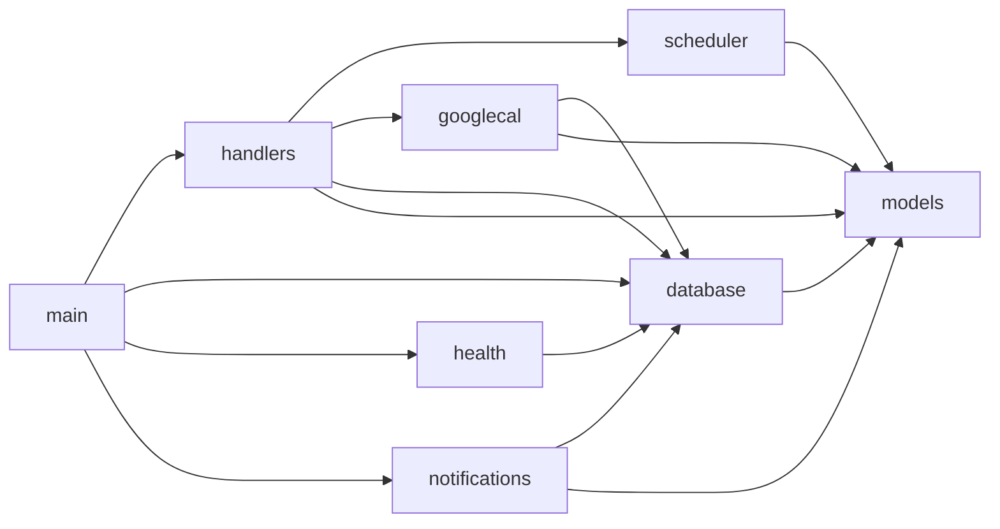

**Правило:** `models` не зависит ни от кого. Бизнес-логика планирования изолирована в `scheduler/`, интеграция с Google — в `googlecal/`.

---

## Слой `handlers/` — оркестрация

`BotHandler` — единая точка входа для Telegram:

| Файл | Ответственность |
|------|-----------------|
| `handlers.go` | Роутинг команд и inline-callbacks, CRUD задач, настройки, OAuth |
| `schedule_exec.go` | `executeFullRebuild`, `executeInsertTask`, экспорт в календарь |
| `calendar_busy.go` | `fetchCalendarBusy`, `clearPlanBotCalendar` |
| `calendar_import.go` | `/calendar_import` — внешние события → задачи |
| `calendar_task_sync.go` | Отметка ✅ в календаре при `/complete`, удаление при `/delete` |

### Команды бота

| Группа | Команды |
|--------|---------|
| Onboarding | `/start`, `/help` |
| Задачи | `/addtask`, `/mytasks`, `/complete`, `/delete` |
| Планирование | `/schedule`, `/schedule_slots`, `/today`, `/week` |
| Настройки | `/settings`, `/timezone` |
| Google Calendar | `/google_connect`, `/google_code`, `/google_status`, `/calendar_import` |

### Inline-кнопки после `/addtask`

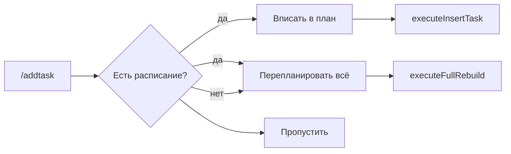

Callback data: `plan_insert:{id}`, `plan_rebuild:{id}`, `plan_skip`, `view_today`, `view_week`.

---

## Поток: полное перепланирование (`/schedule`)

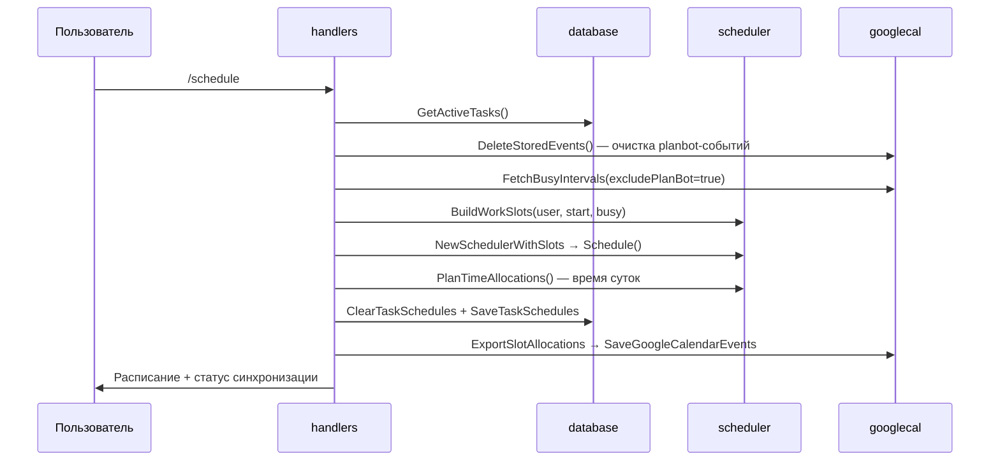

**Ключевые решения:**
- Стартовая дата — **завтра** в таймзоне пользователя (`scheduleStartDate`)
- При rebuild события PlanBot в Google **не считаются** занятостью
- При incremental insert — stored PlanBot events **учитываются** как busy

---

## Поток: вписывание задачи (incremental)

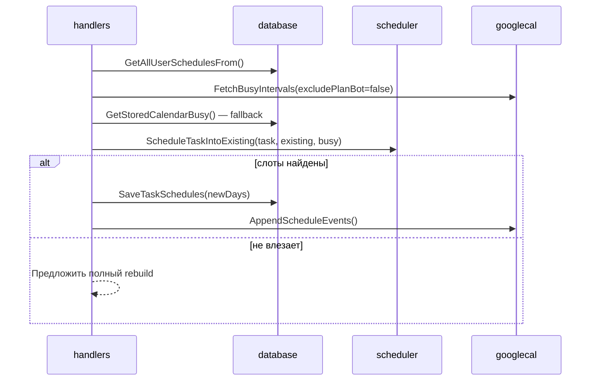

---

## Поток: импорт из календаря (`/calendar_import`)

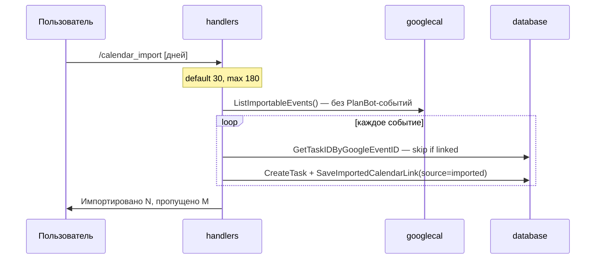

---

## Слой `scheduler/` — планирование

Двухуровневая модель: **дни** → **временные слоты**.

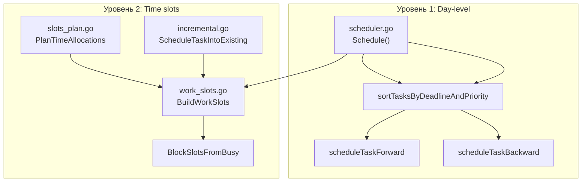

| Модуль | Функции | Роль |
|--------|---------|------|
| `scheduler.go` | `Schedule`, `NewScheduler`, `NewSchedulerWithSlots` | Распределение часов по дням |
| `work_slots.go` | `BuildWorkSlots`, `FreeHoursOnDate`, `PlanningHorizonDays` | Сетка рабочих слотов 60 мин |
| `busy_merge.go` | `MergeBusyIntervals`, `BusyHoursOnDate` | Объединение занятости |
| `slots_plan.go` | `PlanTimeAllocations`, `MergeSlotAllocations` | Конкретное время 09:00–18:00 |
| `incremental.go` | `ScheduleTaskIntoExisting` | Одна задача в существующий план |

**Алгоритм:** Deadline-Aware Hybrid Scheduling · **O(N × D)**  
Подробнее: [ALGORITHM.md](./ALGORITHM.md)

### Переменные окружения планировщика

| Переменная | Default | Описание |
|------------|---------|----------|
| `PLANNING_HORIZON_DAYS` | `365` | Горизонт планирования |
| `PLANNING_SLOT_MINUTES` | `60` | Размер временного слота |

---

## Слой `googlecal/` — Google Calendar

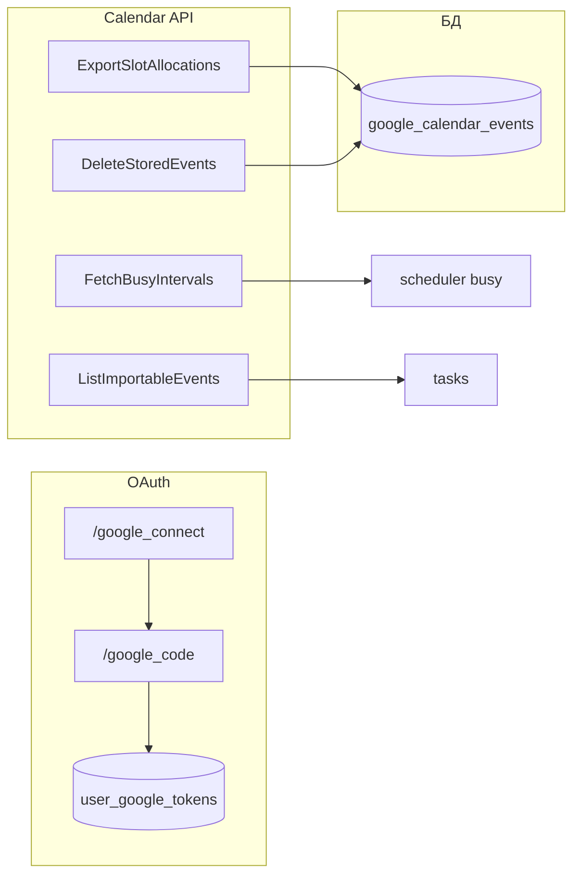

| Файл | Назначение |
|------|------------|
| `googlecal.go` | `ConfigFromEnv`, `NewFromAccessToken`, `NewWithStoredToken` |
| `client_user.go` | `ClientForUser` — авто-refresh токена |
| `fetch.go` | Busy intervals, all-day → рабочие часы |
| `export.go` | Создание timed events с префиксом `☐` |
| `sync.go` | `SyncUserSchedule`, `AppendScheduleEvents`, `DeleteStoredEvents` |
| `task_bridge.go` | Импорт, `MarkTaskCompletedInCalendar` |

**Env:** `GOOGLE_CLIENT_ID`, `GOOGLE_CLIENT_SECRET`

---

## Слой `database/`

| Файл | Назначение |
|------|------------|
| `db.go` | `InitDB`, `CloseDB`, connection string из env |
| `migrate.go` | `EnsureSchema` при старте (идемпотентно) |
| `queries.go` | Users, tasks, schedules, settings, Google tokens |
| `queries_calendar.go` | `google_calendar_events`, busy fallback, import links |
| `tasks.go` | Legacy-запросы (`GetTasksForToday`, `GetTasksForWeek`) |

**5 таблиц:** `users`, `tasks`, `task_schedules`, `user_google_tokens`, `google_calendar_events` — см. [DATABASE_SCHEMA.md](./DATABASE_SCHEMA.md).

---

## Слой `models/`

| Структура | Использование |
|-----------|---------------|
| `User` | Профиль + `TimeZone`, `WorkStart/End`, `DailyCapacity`, `WorkDays` |
| `Task` | Задача с `HoursRequired`, `Priority`, `Deadline`, `Status` |
| `DaySchedule` | План на день: список `ScheduledTaskInfo` |
| `ScheduleResult` | Результат `Schedule()`: дни + `UnscheduledTasks` |
| `TimeSlot` | Слот внутри дня (capacity / allocated) |
| `BusyInterval` | Занятый интервал из календаря |
| `SlotAllocation` | Конкретный блок времени для экспорта в Google |
| `GoogleToken` | OAuth-токены |
| `GoogleCalendarEvent` | Метаданные экспортированного события |

---

## `notifications/` — напоминания

Фоновая горутина (ticker **30 мин**):

- В **09:00** по таймзоне пользователя — задачи с дедлайном **завтра**
- В **09:00** в день дедлайна — задачи, дедлайн которых **сегодня**

Работает независимо от long polling; использует прямые SQL-запросы к `database.DB`.

---

## `health/` — observability

| Endpoint | Тип | Поведение |
|----------|-----|-----------|
| `GET /health` | Liveness | JSON: status, version, database ping |
| `GET /ready` | Readiness | 200 если БД доступна |
| `GET /` | Info | service name + version |

Используется Docker healthcheck и оркестраторами (Kubernetes, Compose).

---

## Развёртывание

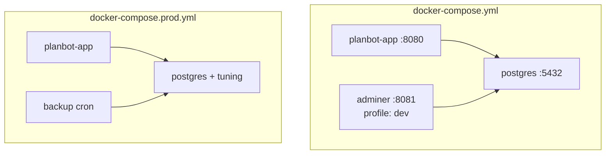

| Режим | Команда | Особенности |
|-------|---------|-------------|
| Dev | `docker-compose --profile dev up -d` | Adminer на :8081 |
| Prod | `docker-compose -f docker-compose.prod.yml up -d` | Backup, лимиты PG |

Multi-stage **Dockerfile**: builder (Go 1.25) → alpine runtime + `postgresql-client`.

---

## CI/CD

GitHub Actions (`.github/workflows/ci.yml`):

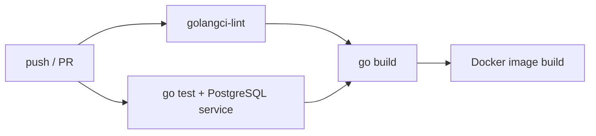

Покрытие: Codecov. Тесты: `scheduler`, `handlers`, `googlecal`, `health`, `database` (integration).

---

## Тестирование (текущее состояние)

| Пакет | Файлы | Что покрыто |
|-------|-------|-------------|
| `scheduler/` | `*_test.go` (5 файлов) | Schedule, slots, busy, incremental |
| `handlers/` | `parsing_test.go` | parseDate, callbacks, форматирование |
| `googlecal/` | `fetch_test.go`, `config_test.go` | Парсинг событий, OAuth config |
| `health/` | `health_test.go` | HTTP handlers |
| `database/` | `integration_test.go` | CRUD (skip без DB_HOST) |

```bash
go test ./...
make test
```

---

## Принципы проектирования

### Separation of Concerns

| Слой | Зона ответственности |
|------|---------------------|
| `handlers` | Telegram UI, валидация ввода, оркестрация |
| `scheduler` | Чистая бизнес-логика планирования |
| `googlecal` | Внешняя интеграция, OAuth |
| `database` | SQL, транзакции |
| `models` | Доменные типы без зависимостей |

### Обработка ошибок

- Ошибки БД и API **логируются** (`log.Printf`)
- Пользователю — **понятные сообщения** на русском
- Сбой Google Calendar **не отменяет** планирование в БД (graceful degradation)

### Конфигурация

Все секреты и параметры — через **переменные окружения** (`.env` локально). См. `env.example`.

---

## Безопасность

| Область | Мера |
|---------|------|
| SQL | Prepared statements, параметризованные запросы |
| Секреты | `TELEGRAM_BOT_TOKEN`, `DB_PASSWORD`, Google OAuth — только в env |
| Доступ к задачам | `GetTaskByIDForUser`, фильтрация по `user_id` |
| Google OAuth | `state=tguser-{id}`, offline refresh token |
| Ввод | Валидация часов, приоритета 1–10, форматов дат |

---

## Масштабируемость

### Текущая модель

- **1 инстанс** бота (long polling — один получатель updates)
- **1 connection pool** к PostgreSQL
- Синхронная обработка сообщений в цикле `for update := range updates`

### Пути масштабирования

1. **Webhook** вместо long polling + load balancer
2. **Redis** — кэш расписаний и настроек пользователей
3. **Очередь** — вынести `/schedule` и calendar sync в worker
4. **Read replicas** — для `/today`, `/week`, отчётов
5. **Партиционирование** `task_schedules` по `scheduled_date`

---

## Метрики (рекомендации)

| Метрика | Зачем |
|---------|-------|
| `planbot_schedule_duration_ms` | Время полного rebuild |
| `planbot_unscheduled_tasks_total` | Доля незапланированных |
| `planbot_calendar_sync_errors` | Сбои Google API |
| `planbot_active_users` | DAU по `users.updated_at` |
| Health `/ready` | Алертинг доступности БД |

Сейчас: структурные логи в stdout + Docker json-file driver (max 10m × 3 files).

---

## Связанные документы

| Документ | Содержание |
|----------|------------|
| [DATABASE_SCHEMA.md](./DATABASE_SCHEMA.md) | ER-диаграмма, таблицы, SQL |
| [ALGORITHM.md](./ALGORITHM.md) | Алгоритм планирования (полное описание) |
| [README.md](./README.md) | Установка, команды, Makefile |
| [docs/presentation.html](./docs/presentation.html) | Презентация проекта |

---

*Документ обновлён: июнь 2026*
