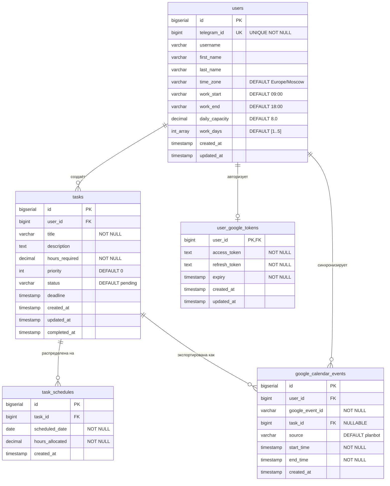
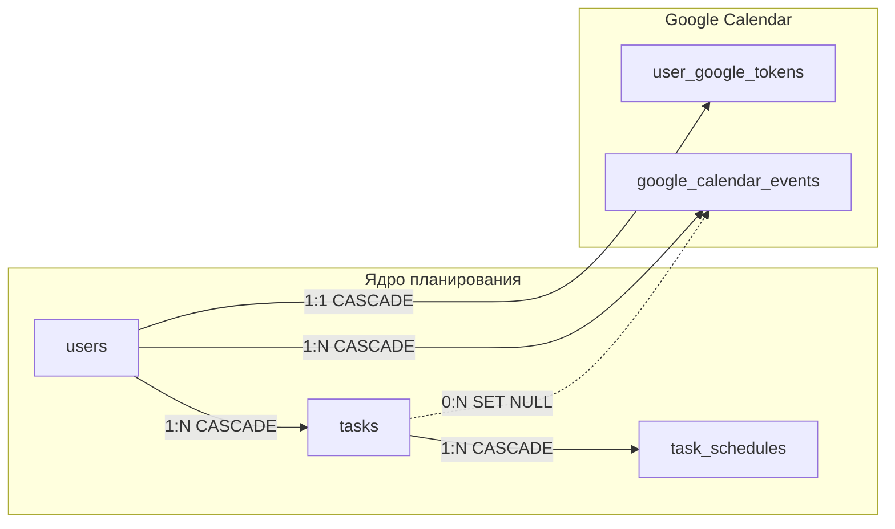
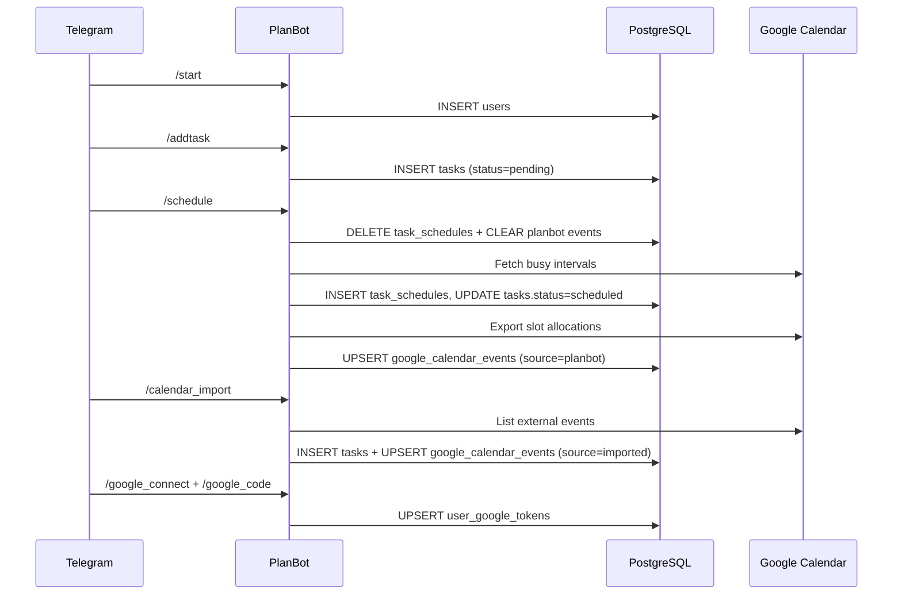

# Схема базы данных PlanBot

> Актуально для `database/schema.sql` · PostgreSQL 15 · 5 таблиц

PlanBot хранит профили пользователей Telegram, их задачи, дневное расписание и связь с Google Calendar (OAuth-токены + экспорт/импорт событий).

---

## ER-диаграмма (Mermaid)



---

## Схема для dbdiagram.io / DBML

Скопируйте блок ниже на [dbdiagram.io](https://dbdiagram.io) для интерактивной схемы:

```dbml
Project PlanBot {
  database_type: "PostgreSQL"
  Note: "Telegram task planner with Google Calendar sync"
}

Table users {
  id bigserial [pk, increment]
  telegram_id bigint [unique, not null, note: "Telegram user ID"]
  username varchar(255)
  first_name varchar(255)
  last_name varchar(255)
  time_zone varchar(255) [default: "Europe/Moscow"]
  work_start varchar(5) [default: "09:00", note: "HH:MM"]
  work_end varchar(5) [default: "18:00", note: "HH:MM"]
  daily_capacity decimal(5,2) [default: 8.0, note: "hours per work day"]
  work_days integer[] [default: "ARRAY[1,2,3,4,5]", note: "1=Mon … 7=Sun"]
  created_at timestamp [default: `CURRENT_TIMESTAMP`]
  updated_at timestamp [default: `CURRENT_TIMESTAMP`]

  indexes {
    telegram_id [name: "idx_users_telegram_id"]
  }
}

Table tasks {
  id bigserial [pk, increment]
  user_id bigint [not null, ref: > users.id]
  title varchar(500) [not null]
  description text
  hours_required decimal(5,2) [not null]
  priority integer [default: 0, note: "1–10 in bot UI"]
  status varchar(50) [default: "pending"]
  deadline timestamp
  created_at timestamp [default: `CURRENT_TIMESTAMP`]
  updated_at timestamp [default: `CURRENT_TIMESTAMP`]
  completed_at timestamp

  indexes {
    user_id [name: "idx_tasks_user_id"]
    status [name: "idx_tasks_status"]
    deadline [name: "idx_tasks_deadline"]
  }
}

Table task_schedules {
  id bigserial [pk, increment]
  task_id bigint [not null, ref: > tasks.id]
  scheduled_date date [not null]
  hours_allocated decimal(5,2) [not null]
  created_at timestamp [default: `CURRENT_TIMESTAMP`]

  indexes {
    task_id [name: "idx_task_schedules_task_id"]
    scheduled_date [name: "idx_task_schedules_date"]
  }
}

Table user_google_tokens {
  user_id bigint [pk, ref: - users.id, note: "1:1 with user"]
  access_token text [not null]
  refresh_token text [not null]
  expiry timestamp [not null]
  created_at timestamp [default: `CURRENT_TIMESTAMP`]
  updated_at timestamp [default: `CURRENT_TIMESTAMP`]
}

Table google_calendar_events {
  id bigserial [pk, increment]
  user_id bigint [not null, ref: > users.id]
  google_event_id varchar(255) [not null]
  task_id bigint [ref: > tasks.id, note: "ON DELETE SET NULL"]
  source varchar(50) [not null, default: "planbot", note: "planbot | imported"]
  start_time timestamp [not null]
  end_time timestamp [not null]
  created_at timestamp [default: `CURRENT_TIMESTAMP`]

  indexes {
    user_id [name: "idx_google_calendar_events_user_id"]
    (user_id, google_event_id) [unique, name: "idx_google_calendar_events_user_event"]
  }
}
```

---

## Обзор связей



| Связь | Тип | ON DELETE | Назначение |
|-------|-----|-----------|------------|
| `users` → `tasks` | 1:N | CASCADE | Задачи принадлежат пользователю |
| `tasks` → `task_schedules` | 1:N | CASCADE | Задача может быть разбита на несколько дней |
| `users` → `user_google_tokens` | 1:1 | CASCADE | OAuth-токены Google на пользователя |
| `users` → `google_calendar_events` | 1:N | CASCADE | Все привязанные события календаря |
| `tasks` → `google_calendar_events` | 1:N | SET NULL | Событие может ссылаться на задачу; при удалении задачи связь обнуляется |

---

## Таблицы

### `users`

Профиль Telegram-пользователя и настройки планировщика.

| Поле | Тип | По умолчанию | Описание |
|------|-----|--------------|----------|
| `id` | BIGSERIAL | — | PK |
| `telegram_id` | BIGINT | — | Уникальный ID в Telegram |
| `username` | VARCHAR(255) | NULL | @username |
| `first_name` | VARCHAR(255) | NULL | Имя |
| `last_name` | VARCHAR(255) | NULL | Фамилия |
| `time_zone` | VARCHAR(255) | `Europe/Moscow` | IANA-таймзона (`/timezone`) |
| `work_start` | VARCHAR(5) | `09:00` | Начало рабочего дня (HH:MM) |
| `work_end` | VARCHAR(5) | `18:00` | Конец рабочего дня (HH:MM) |
| `daily_capacity` | DECIMAL(5,2) | `8.0` | Часов в рабочий день |
| `work_days` | INTEGER[] | `[1,2,3,4,5]` | Рабочие дни: 1=Пн … 7=Вс |
| `created_at` | TIMESTAMP | `now()` | Дата регистрации |
| `updated_at` | TIMESTAMP | `now()` | Последнее обновление |

**Индекс:** `idx_users_telegram_id`

---

### `tasks`

Задачи пользователя.

| Поле | Тип | По умолчанию | Описание |
|------|-----|--------------|----------|
| `id` | BIGSERIAL | — | PK |
| `user_id` | BIGINT | — | FK → `users.id` |
| `title` | VARCHAR(500) | — | Название (обязательно) |
| `description` | TEXT | NULL | Описание |
| `hours_required` | DECIMAL(5,2) | — | Трудоёмкость в часах |
| `priority` | INTEGER | `0` | Приоритет (в боте: 1–10) |
| `status` | VARCHAR(50) | `pending` | `pending`, `scheduled`, `in_progress`, `completed`, `cancelled` |
| `deadline` | TIMESTAMP | NULL | Жёсткий дедлайн |
| `created_at` | TIMESTAMP | `now()` | Создание |
| `updated_at` | TIMESTAMP | `now()` | Изменение |
| `completed_at` | TIMESTAMP | NULL | Завершение |

**Индексы:** `idx_tasks_user_id`, `idx_tasks_status`, `idx_tasks_deadline`

---

### `task_schedules`

Дневное расписание: сколько часов задачи выделено на конкретную дату.

| Поле | Тип | Описание |
|------|-----|----------|
| `id` | BIGSERIAL | PK |
| `task_id` | BIGINT | FK → `tasks.id` |
| `scheduled_date` | DATE | День планирования |
| `hours_allocated` | DECIMAL(5,2) | Часов в этот день |
| `created_at` | TIMESTAMP | Создание записи |

**Индексы:** `idx_task_schedules_task_id`, `idx_task_schedules_date`

> Одна задача может иметь несколько строк (разбиение на дни). Сумма `hours_allocated` обычно равна `hours_required`, но при частичном планировании может быть меньше.

---

### `user_google_tokens`

OAuth 2.0 токены Google Calendar (одна запись на пользователя).

| Поле | Тип | Описание |
|------|-----|----------|
| `user_id` | BIGINT | PK + FK → `users.id` |
| `access_token` | TEXT | Access token |
| `refresh_token` | TEXT | Refresh token |
| `expiry` | TIMESTAMP | Срок действия access token |
| `created_at` | TIMESTAMP | Первое подключение |
| `updated_at` | TIMESTAMP | Последнее обновление токена |

Используется командами `/google_connect`, `/google_code`, `/google_status`.

---

### `google_calendar_events`

Связь между задачами бота и событиями в Google Calendar.

| Поле | Тип | По умолчанию | Описание |
|------|-----|--------------|----------|
| `id` | BIGSERIAL | — | PK |
| `user_id` | BIGINT | — | FK → `users.id` |
| `google_event_id` | VARCHAR(255) | — | ID события в Google |
| `task_id` | BIGINT | NULL | FK → `tasks.id` (может быть NULL) |
| `source` | VARCHAR(50) | `planbot` | Происхождение связи (см. ниже) |
| `start_time` | TIMESTAMP | — | Начало события |
| `end_time` | TIMESTAMP | — | Конец события |
| `created_at` | TIMESTAMP | `now()` | Создание связи |

**Индексы:**
- `idx_google_calendar_events_user_id`
- `idx_google_calendar_events_user_event` — **UNIQUE** `(user_id, google_event_id)`

#### Значения `source`

| Значение | Когда создаётся | Поведение |
|----------|-----------------|-----------|
| `planbot` | Экспорт при `/schedule` | Удаляются при полном перепланировании; учитываются как busy при планировании |
| `imported` | `/calendar_import` | Связь внешнего события → задача; не дублируется при повторном импорте |

---

## Жизненный цикл данных



---

## Примеры SQL-запросов

### Расписание пользователя на день

```sql
SELECT t.title, t.priority, ts.hours_allocated
FROM task_schedules ts
JOIN tasks t ON ts.task_id = t.id
WHERE t.user_id = 1
  AND ts.scheduled_date = CURRENT_DATE
ORDER BY t.priority DESC;
```

### Загрузка по дням vs дневная ёмкость

```sql
SELECT
    ts.scheduled_date,
    SUM(ts.hours_allocated) AS planned_hours,
    u.daily_capacity,
    u.daily_capacity - SUM(ts.hours_allocated) AS free_hours
FROM task_schedules ts
JOIN tasks t ON ts.task_id = t.id
JOIN users u ON t.user_id = u.id
WHERE u.id = 1
GROUP BY ts.scheduled_date, u.daily_capacity
ORDER BY ts.scheduled_date;
```

### Экспортированные события PlanBot в календаре

```sql
SELECT g.google_event_id, t.title, g.start_time, g.end_time
FROM google_calendar_events g
LEFT JOIN tasks t ON t.id = g.task_id
WHERE g.user_id = 1
  AND g.source = 'planbot'
ORDER BY g.start_time;
```

### Импортированные из календаря задачи

```sql
SELECT t.id, t.title, g.google_event_id, g.start_time, g.end_time
FROM google_calendar_events g
JOIN tasks t ON t.id = g.task_id
WHERE g.user_id = 1
  AND g.source = 'imported';
```

### Просроченные активные задачи

```sql
SELECT id, title, deadline, status
FROM tasks
WHERE user_id = 1
  AND deadline < CURRENT_TIMESTAMP
  AND status NOT IN ('completed', 'cancelled')
ORDER BY deadline;
```

---

## Ограничения целостности

### Первичные ключи
- `users.id`, `tasks.id`, `task_schedules.id`, `google_calendar_events.id`
- `user_google_tokens.user_id` (одновременно PK и FK)

### Уникальные ограничения
- `users.telegram_id`
- `google_calendar_events (user_id, google_event_id)`

### Внешние ключи

| FK | Ссылка | ON DELETE |
|----|--------|-----------|
| `tasks.user_id` | `users.id` | CASCADE |
| `task_schedules.task_id` | `tasks.id` | CASCADE |
| `user_google_tokens.user_id` | `users.id` | CASCADE |
| `google_calendar_events.user_id` | `users.id` | CASCADE |
| `google_calendar_events.task_id` | `tasks.id` | SET NULL |

### Статусы задач

```
pending → scheduled → in_progress → completed
                  ↘ cancelled
```

---

## Миграции и развёртывание

### Новая база

```bash
psql -U planbot -d planbot -f database/schema.sql
```

Docker Compose монтирует `schema.sql` в `docker-entrypoint-initdb.d/` при первом старте контейнера.

### Обновление существующей базы

```bash
psql -U planbot -d planbot -f database/migrations.sql
```

При старте приложения `database.EnsureSchema()` дополнительно идемпотентно создаёт/обновляет `google_calendar_events` (колонка `source`, индексы).

### Порядок создания таблиц

```
users
 ├── tasks
 │    └── task_schedules
 ├── user_google_tokens
 └── google_calendar_events ──→ tasks (optional FK)
```

### Порядок удаления (обратный)

```sql
DROP TABLE IF EXISTS google_calendar_events CASCADE;
DROP TABLE IF EXISTS user_google_tokens CASCADE;
DROP TABLE IF EXISTS task_schedules CASCADE;
DROP TABLE IF EXISTS tasks CASCADE;
DROP TABLE IF EXISTS users CASCADE;
```

---

## Нормализация

Схема соответствует **3NF**:

- **users** — профиль и настройки планирования
- **tasks** — сущность «задача»
- **task_schedules** — распределение задачи по дням (отдельная сущность, 1:N)
- **user_google_tokens** — секреты OAuth вынесены из `users`
- **google_calendar_events** — связь с внешней системой (Google), не дублирует данные задачи

Денормализация намеренно отсутствует: `google_calendar_events` хранит только ID события и временной интервал, заголовок берётся из `tasks` через JOIN.

---

## Оценка объёма (1000 пользователей)

| Таблица | Строк (оценка) | Размер |
|---------|----------------|--------|
| `users` | 1 000 | ~300 КБ |
| `tasks` | ~10 000 | ~5 МБ |
| `task_schedules` | ~30 000 | ~3 МБ |
| `user_google_tokens` | ~200 | ~100 КБ |
| `google_calendar_events` | ~15 000 | ~2 МБ |

**Итого:** ~10 МБ для 1000 активных пользователей (без учёта индексов и TOAST).

---

## Файлы схемы в репозитории

| Файл | Назначение |
|------|------------|
| `database/schema.sql` | Полная схема для нового развёртывания |
| `database/migrations.sql` | Инкрементальные миграции для апгрейда |
| `database/migrate.go` | Runtime ensure при старте бота |
| `database/queries.go` | CRUD задач и пользователей |
| `database/queries_calendar.go` | Google Calendar: busy, import, export |

---

## Визуализаторы

Схему можно открыть в:

- **GitHub / GitLab** — Mermaid ER-диаграмма рендерится из этого файла
- **[dbdiagram.io](https://dbdiagram.io)** — вставить блок DBML выше
- **DBeaver / pgAdmin / Adminer** — reverse engineering из живой БД (`http://localhost:8081` в dev-профиле Docker)
