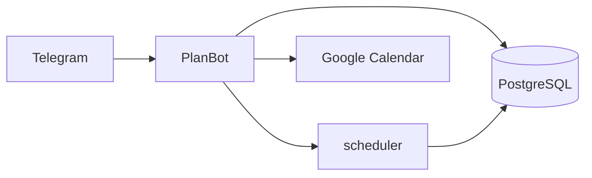

# PlanBot

**Умный Telegram-бот для планирования задач** — автоматически распределяет работу по дням и часам с учётом дедлайнов, приоритетов, рабочего графика и Google Calendar.

<p align="center">
  
  
  
  
</p>

---

## Содержание

- [Возможности](#возможности)
- [Быстрый старт](#быстрый-старт)
- [Команды бота](#команды-бота)
- [Google Calendar](#google-calendar)
- [Переменные окружения](#переменные-окружения)
- [Разработка](#разработка)
- [Документация](#документация)
- [Лицензия](#лицензия)

---

## Возможности

| | |
|---|---|
| **Планирование** | Deadline-Aware алгоритм: задачи с дедлайном — «с конца», без дедлайна — с ближайшего дня |
| **Слоты времени** | Рабочие часы (`09:00–18:00`), выходные, занятость из календаря |
| **Google Calendar** | OAuth, экспорт расписания, импорт внешних событий в задачи |
| **Два режима** | Вписать задачу в текущий план или перепланировать всё с нуля |
| **Настройки** | Часы/день, рабочие дни, таймзона, начало и конец рабочего дня |
| **Напоминания** | Уведомления о дедлайнах (завтра / сегодня в 09:00 по таймзоне пользователя) |



---

## Быстрый старт

### Требования

- [Go 1.25+](https://go.dev/dl/) (для локальной разработки)
- [Docker](https://www.docker.com/) и Docker Compose (рекомендуется)
- [Telegram Bot Token](https://t.me/BotFather)
- PostgreSQL 15 (входит в Docker Compose)

### Docker (рекомендуется)

```bash
git clone <your-repo-url>
cd PlanBot

cp env.example .env
# Укажите TELEGRAM_BOT_TOKEN и при необходимости GOOGLE_CLIENT_ID / GOOGLE_CLIENT_SECRET

docker-compose up -d --build
docker-compose logs -f bot
```

**С Adminer** (веб-интерфейс к БД на http://localhost:8081):

```bash
docker-compose --profile dev up -d
```

| Сервис | URL |
|--------|-----|
| Бот (health) | http://localhost:8080/health |
| Adminer (dev) | http://localhost:8081 |
| PostgreSQL | localhost:5432 |

### Локально (без Docker)

```bash
cp env.example .env
make install
make db-setup
make run
```

---

## Команды бота

### Старт

| Команда | Описание |
|---------|----------|
| `/start` | Регистрация и приветствие |
| `/help` | Полный список команд |

### Задачи

```text
/addtask Название | часы | приоритет | дедлайн
```

Минимум: `/addtask Задача | 2`

```text
/addtask Написать отчёт | 4 | 8 | 25.12.2025
/addtask Прочитать статью | 1.5 | 3
```

| Команда | Описание |
|---------|----------|
| `/mytasks` | Все задачи со статусами |
| `/complete ID` | Отметить выполненной |
| `/delete ID` | Удалить задачу |

После `/addtask` бот предложит **вписать в план**, **перепланировать всё** или пропустить.

### Планирование

| Команда | Описание |
|---------|----------|
| `/schedule` | Полное перепланирование всех активных задач |
| `/schedule_slots` | Предпросмотр слотов по времени (без записи в БД) |
| `/today` | Расписание на сегодня |
| `/week` | Расписание на неделю |

### Настройки

```text
/settings 8 | 1,2,3,4,5
/settings 6 | 1,2,3,4,5 | 09:00-18:00
/timezone Europe/Moscow
```

Дни недели: `1` = Пн … `7` = Вс.

---

## Google Calendar

```text
/google_connect          # ссылка для OAuth
/google_code ВАШ_КОД    # завершить подключение
/google_status           # статус токена
/calendar_import         # импорт событий (30 дней по умолчанию)
/calendar_import 14      # импорт на 14 дней (макс. 180)
```

При `/schedule` расписание экспортируется в Google Calendar как timed-события. Внешние события календаря учитываются как занятость при планировании.

Для OAuth на сервере нужны `GOOGLE_CLIENT_ID` и `GOOGLE_CLIENT_SECRET` в `.env`.

---

## Переменные окружения

| Переменная | Обязательно | Описание |
|------------|-------------|----------|
| `TELEGRAM_BOT_TOKEN` | да | Токен от @BotFather |
| `DB_HOST`, `DB_PORT`, `DB_USER`, `DB_PASSWORD`, `DB_NAME` | да | PostgreSQL |
| `DB_SSLMODE` | нет | `disable` / `require` (default: `disable`) |
| `HEALTH_PORT` | нет | HTTP health-сервер (default: `8080`) |
| `GOOGLE_CLIENT_ID`, `GOOGLE_CLIENT_SECRET` | для Calendar | OAuth Google |
| `PLANNING_HORIZON_DAYS` | нет | Горизонт планирования (default: `365`) |
| `PLANNING_SLOT_MINUTES` | нет | Размер слота в минутах (default: `60`) |
| `TZ` | нет | Таймзона контейнера (default: `Europe/Moscow`) |
| `BOT_DEBUG` | нет | Логи Telegram API (`true`/`false`) |

Полный пример — в [`env.example`](env.example).

---

## Разработка

### Структура проекта

```text
PlanBot/
├── main.go
├── handlers/          # Telegram: команды, callbacks, calendar
├── scheduler/         # Алгоритм планирования + слоты
├── database/          # PostgreSQL, schema, migrations
├── googlecal/         # Google Calendar API
├── notifications/     # Напоминания о дедлайнах
├── health/            # /health, /ready
├── models/
├── docs/              # ARCHITECTURE, ALGORITHM, DATABASE_SCHEMA, presentation
├── Dockerfile
├── docker-compose.yml
└── Makefile
```

### Makefile

```bash
make help            # все команды
make build           # собрать бинарник
make run             # запустить локально
make dev             # hot reload (air)
make test            # go test ./...
make lint            # golangci-lint
make docker-up-dev   # Docker + Adminer
make db-setup        # создать БД и схему
```

### Тесты

```bash
go test ./...
```

Покрытие: `scheduler`, `handlers`, `googlecal`, `health`, `database` (integration при наличии `DB_HOST`).

### Health checks

```bash
curl http://localhost:8080/health
curl http://localhost:8080/ready
```

### CI/CD

GitHub Actions: lint → тесты с PostgreSQL → сборка → Docker image. См. [`.github/workflows/ci.yml`](.github/workflows/ci.yml).

### Production

```bash
docker-compose -f docker-compose.prod.yml up -d
```

---

## Документация

| Файл | Описание |
|------|----------|
| [docs/ARCHITECTURE.md](docs/ARCHITECTURE.md) | Архитектура, потоки данных, пакеты |
| [docs/ALGORITHM.md](docs/ALGORITHM.md) | Алгоритм планирования (полное описание) |
| [docs/DATABASE_SCHEMA.md](docs/DATABASE_SCHEMA.md) | Схема БД, ER-диаграммы |
| [docs/presentation.html](docs/presentation.html) | Презентация проекта (открыть в браузере) |

---

## Алгоритм (кратко)

**Deadline-Aware Hybrid Scheduling** · O(N × D)

1. Сортировка: дедлайн → близость срока → приоритет → короткие задачи
2. **С дедлайном** — планирование назад от срока
3. **Без дедлайна** — вперёд от завтра
4. Учёт `daily_capacity`, `work_days`, занятости Google Calendar
5. `PlanTimeAllocations()` — привязка к конкретному времени в рабочих часах

Подробнее → [docs/ALGORITHM.md](docs/ALGORITHM.md)

---

## Вклад в проект

Issues и pull requests приветствуются. Перед PR: `make test` и `make lint`.

## Лицензия

[MIT License](LICENSE)
